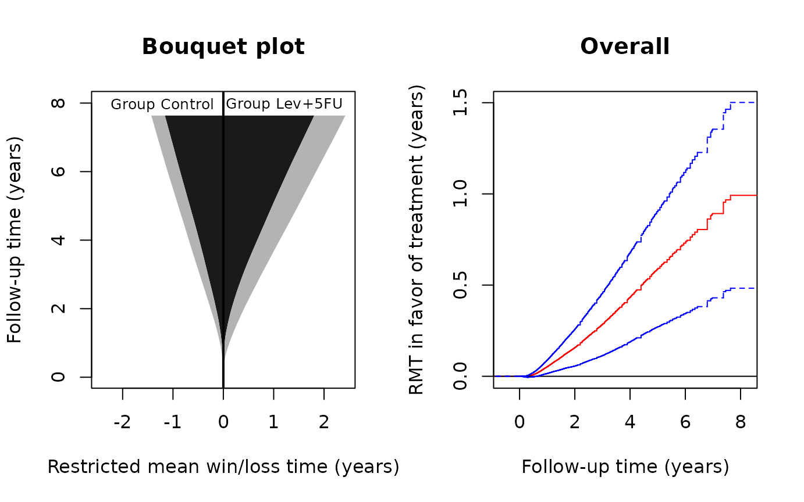
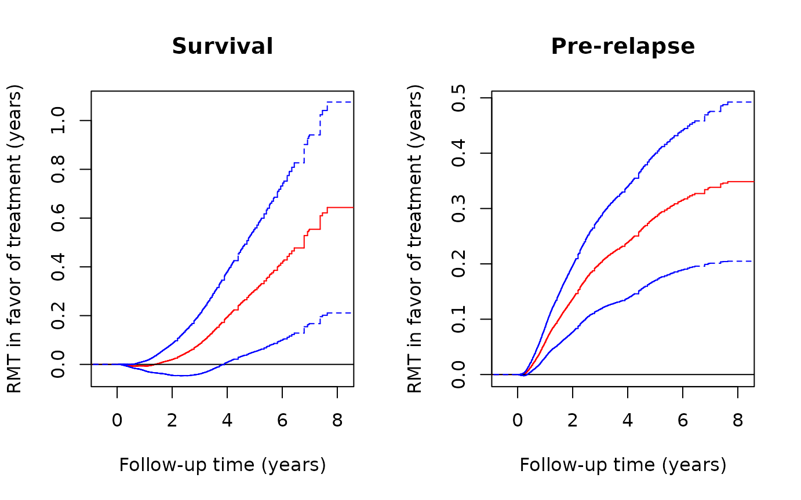

# Analysis of multistate hierarchical outcomes by the restricted mean time in favor of treatment

## INTRODUCTION

This vignette demonstrates the use of the R-package `rmt` for the
restricted-mean-time-in-favor-of-treatment approach to the analysis of
multiple prioritized outcomes.

### Data type

To recap the methodology, we formulate patient experience with multiple
events as a multistate process \\Y(t)\\ taking values in the ordered set
\\\\0,1,\ldots, K, K+1\\\\, with a larger integer representing a more
series condition. For example, \\Y(t)=0\\ if a cancer patient is in a
state of remission, \\Y(t)=1\\ if the cancer has relapsed, \\Y(t)=2\\ if
it has metastasized, and \\Y(t)=3\\ if the patient has died. The
methodology in `rmt` is sufficiently general to be applicable to a wide
range of settings, as long as the following assumptions are met:

1.  The outcome process is **progressive** (can transition only from a
    less serious to a more serious state), i.e., \\Y(t)\leq Y(s)\\ for
    \\t\leq s\\;
2.  Death is the only absorbing state, i.e., no competing risks to death
    (hence “cure models” are not allowed).

### Effect size estimand

Let \\Y^{(a)}\\ denote the outcome process from group \\a\\ (\\a=1\\ for
the treatment and \\a=0\\ for the control). The estimand of interest is
constructed under a generalized pairwise comparison framework (Buyse,
2010). With \\Y^{(1)}\perp Y^{(0)}\\, let \\\mu(\tau)=E\int_0^\tau
I\\Y^{(1)}(t)\< Y^{(0)}(t)\\{\rm d}t - E\int_0^\tau I\\Y^{(1)}(t)\>
Y^{(0)}(t)\\{\rm d}t,\\ for some pre-specified follow-up time \\\tau\\.
We call \\\mu(\tau)\\ the **restricted mean time (RMT) in favor of
treatment** and interpret it as the *average time gained by the
treatment in a more favorable condition*. It generalizes the familiar
restricted mean survival time to account for the intermediate stages in
disease progression. In fact, it can be shown that \\\mu(\tau)\\ reduces
to the net restricted mean survival time (Royston & Parmar, 2011) under
the two-state life-death model. For details of the methodology, refer to
Mao (2021).

The overall effect size can be decomposed into stage-wise components:
\\\mu(\tau)=\sum\_{k=1}^{K+1}\mu_k(\tau)\\ with
\\\begin{equation}\label{eq:comp}\tag{\*} \mu_k(\tau)=E\int_0^\tau
I\\Y^{(1)}(t)\<k, Y^{(0)}(t)=k\\{\rm d}t - E\int_0^\tau
I\\Y^{(0)}(t)\<k, Y^{(1)}(t)=k\\{\rm d}t. \end{equation}\\ The component
\\\mu_k(\tau)\\ can be interpreted as the average \`\`pre-state \\k\\’’
time gained by the treatment among those who have not transitioned to
state \\(k+1)\\ or higher. It is clear that the last component
\\\mu\_{K+1}(t)\\ always stands for the usual net restricted mean
survival time.

## BASIC SYNTAX

### Data fitting and summarization

The main data-fitting function is
[`rmtfit()`](https://lmaowisc.github.io/rmt/reference/rmtfit.md). To use
the function, the input data must be organized in the “long” format.
Specifically, we need an `id` variable containing the unique patient
identifiers, a `time` variable containing the times of the transitioning
events, a `status` variable labeling the event type (`status=k` if
transitioning to state \\k\\ and `status=0` if censored; note that death
is represented by `status=K+1`), and, finally, a *binary* `trt` variable
containing the subject-level treatment arm indicators. If `id`, `time`,
`status`, and `trt` are all variables in a data frame `data`, we can
then use the formula form of the function:

``` r

obj=rmtfit(ms(id,time,status)~trt,data)
```

Otherwise, we can feed the vector-valued variables directly into the
function:

``` r

obj=rmtfit(id,time,status,trt,type="multistate")
```

The (default) `type` option specifies the input as multistate data
rather than recurrent event data (`type=="recurrent"`).

The returned object `obj` contains basically all the information about
the overall and stage-wise RMTs. To extract relevant information for a
particular \\\tau=\\`tau`, use

``` r

summary(obj,tau)
```

### Plot of \\\mu(\cdot)\\

To plot the estimated \\\mu(\tau)\\ as a function of \\\tau\\, use

``` r

plot(obj,conf=TRUE)
```

The option `conf=T` requests the 95% confidence limits to be overlaid.
The color and line type of the confidence limits can be controlled by
arguments `conf.col` and `conf.lty`, respectively. Other graphical
parameters can be specified and, if so, will be passed to the underlying
generic `plot` method.

### Bouquet plot

The dynamic profile of treatment effects as follow-up progresses is
captured by the bouquet plot, which puts \\\tau\\ on the vertical axis
and plots the stage-wise restricted mean win/loss times, i.e., the first
and second terms on the right hand side of \\(\*)\\, as functions of
\\\tau\\ on the two sides. The bouquet plot is useful because it
visualizes the component-wise contributions to the overall effect. To
plot it, use

``` r

bouquet(obj)
```

Other graphical parameters can be specified and, if so, will be passed
to the underlying generic `plot` method.

## AN EXAMPLE WITH A COLON CANCER TRIAL

### Data description

A landmark colon cancer trial on the efficacy of levamisole and
fluorouracil was reported by Moertel et al. (1990). The trial recruited
929 patients with stage C disease and randomly assigned them to
levamisole treatment alone, levamisole combined with fluorouracil, and
the control. We focus on the comparison between the combined treatment
and control groups, consisting of 304 and 314 patients, respectively.
The endpoints of interest are cancer relapse and death. The death rates
in the treatment and control groups are about 40% and 53%, relapse rates
about 39% and 56%, and median follow-up times about 5.7 and 5.1 years,
respectively.

The dataset `colon_lev` (a subset of the `colon` dataset in the
`survival` package) is contained in the `rmt` package and can be loaded
by

``` r

library(rmt)
head(colon_lev)
#>   id      time status      rx sex age
#> 1  1 2.6502396      1 Lev+5FU   1  43
#> 2  1 4.1642710      2 Lev+5FU   1  43
#> 3  2 8.4517454      0 Lev+5FU   1  63
#> 4  3 1.4839151      1 Control   0  71
#> 5  3 2.6365503      2 Control   0  71
#> 6  4 0.6707734      1 Lev+5FU   0  66
```

The dataset is already in a format suitable for
[`rmtfit()`](https://lmaowisc.github.io/rmt/reference/rmtfit.md)
(`status`= 1 for relapse and = 2 for death).

### Estimation and inference

We first fit the data by

``` r

obj=rmtfit(ms(id,time,status)~rx,data=colon_lev)
## print the event numbers by group
obj
#> Call:
#> rmtfit.formula(formula = ms(id, time, status) ~ rx, data = colon_lev)
#> 
#>           N State 1 Death Med follow-up time
#> Control 315     177   168           5.081451
#> Lev+5FU 304     119   123           5.749487

# summarize the inference results for tau=7.5 years
summary(obj,tau=7.5)
#> Call:
#> rmtfit.formula(formula = ms(id, time, status) ~ rx, data = colon_lev)
#> 
#> Restricted mean winning time by tau = 7.5:
#>           State 1 Survival  Overall
#> Control 0.2681406 1.127625 1.395766
#> Lev+5FU 0.6140686 1.749020 2.363088
#> 
#> Restricted mean time in favor of group "Lev+5FU" by time tau = 7.5:
#>          Estimate  Std.Err Z value  Pr(>|z|)    
#> State 1  0.345928 0.072333  4.7825 1.732e-06 ***
#> Survival 0.621394 0.214220  2.9007 0.0037230 ** 
#> Overall  0.967322 0.253330  3.8184 0.0001343 ***
#> ---
#> Signif. codes:  0 '***' 0.001 '**' 0.01 '*' 0.05 '.' 0.1 ' ' 1
```

From the above output, we conclude that, at 7.5 years, the combined
treatment on average gains the patient 0.97 extra year in a more
favorable state compared to the control. This total effect size
comprises an additional 0.62 year of survival time and 0.35 year of
relapse-free time among the survivors. The matrix containing the
inferential results can be obtained from `summary(obj,tau=7.5)$tab`.

### Graphical analysis

Use the following code to construct the bouquet plot and the plot for
the estimated \\\mu(\cdot)\\:

``` r

# set-up plot parameters
oldpar <- par(mfrow = par("mfrow"))
par(mfrow=c(1,2))

# Bouquet plot
bouquet(obj,main="Bouquet plot",cex.group=0.8, xlab="Restricted mean win/loss time (years)",
        ylab="Follow-up time (years)") #cex.group: font size of group labels#
# Plot of RMT in favor of treatment over time
plot(obj,conf=TRUE,col='red',conf.col='blue',conf.lty=2, xlab="Follow-up time (years)",
        ylab="RMT in favor of treatment (years)",main="Overall")
```



``` r

par(oldpar)
```

From the left panel, both the restricted mean survival (dark gray) and
pre-relapse times (light gray) are clearly in favor of the treatment,
both increasingly so as follow-up continues. From the right panel,
judging from the lower 95% confidence limit, the treatment effect
becomes significant at the 0.05 level soon after randomization and stays
so till the end of the study. To plot the component-specific curves ,
run

``` r

# set-up plot parameters
oldpar <- par(mfrow = par("mfrow"))
par(mfrow=c(1,2))

# Plot of component-wise RMT in favor of treatment over time
plot(obj,k=2,conf=TRUE,col='red',conf.col='blue',conf.lty=2, xlab="Follow-up time (years)",
        ylab="RMT in favor of treatment (years)",main="Survival")
plot(obj,k=1,conf=TRUE,col='red',conf.col='blue',conf.lty=2, xlab="Follow-up time (years)",
        ylab="RMT in favor of treatment (years)",main="Pre-relapse")
```



``` r


par(oldpar)
```

## References

- Buyse, M. (2010). Generalized pairwise comparisons of prioritized
  outcomes in the two‐sample problem. *Statistics in Medicine*, 29,
  3245–3257.
- Mao, L. (2021). On restricted mean time in favour of treatment.
  *Submitted*.
- Moertel, C. G., Fleming, T. R., Macdonald, J. S., Haller, D. G.,
  Laurie, J. A., Goodman, P. J., … & Veeder, M. H. (1990). Levamisole
  and fluorouracil for adjuvant therapy of resected colon carcinoma.
  *New England Journal of Medicine*, 322, 352–358.
- Royston, P. & Parmar, M. K. (2011). The use of restricted mean
  survival time to estimate the treatment effect in randomized clinical
  trials when the proportional hazards assumption is in doubt.
  *Statistics in Medicine*, 30, 2409–2421.
