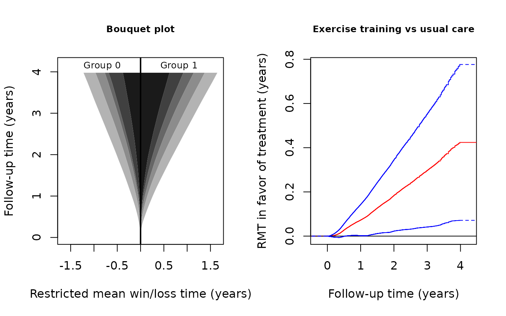

# Analysis of composite endpoints of recurrent event and death by the restricted mean time in favor of treatment

## INTRODUCTION

This vignette demonstrates the use of the R-package `rmt` for the
restricted-mean-time-in-favor-of-treatment approach to the analysis of
composite outcomes consisting of recurrent event and death.

### Data type

Let \\N(t)\\ denote the counting process for the recurrent event, e.g.,
repeated hospitalizations, and let \\N_D(t)\\ denote that for death. The
composite outcome process is defined by \\Y(t)=N(t)+\infty N_D(t).\\
That is, \\Y(t)\\ counts the number of non-fatal event on the living
patient and jumps to \\\infty\\ when the patient dies. Traditional ways
of combining the components include:

1.  Time to the first event: \\Y^\*(t)=I\\N(t)+N_D(t)\>0\\\\;
2.  Weighted composite event process (Mao and Lin, 2016):
    \\Y^{\*\*}(t)=N(t)+w_DN_D(t)\\ for some \\w_D\geq 1\\;

Compared to these approaches, \\Y(t)\\ has the advantage of including
all events while prioritizing death in a natural, hierarchical way.

### Effect size estimand

Let \\Y^{(a)}\\ denote the outcome process from group \\a\\ (\\a=1\\ for
the treatment and \\a=0\\ for the control). The estimand of interest is
constructed under a generalized pairwise comparison framework (Buyse,
2010). With \\Y^{(1)}\perp Y^{(0)}\\, let \\\mu(\tau)=E\int_0^\tau
I\\Y^{(1)}(t)\< Y^{(0)}(t)\\{\rm d}t - E\int_0^\tau I\\Y^{(1)}(t)\>
Y^{(0)}(t)\\{\rm d}t,\\ for some pre-specified follow-up time \\\tau\\.
We call \\\mu(\tau)\\ the **restricted mean time (RMT) in favor of
treatment** and interpret it as the *average time gained by the
treatment in a more favorable condition*. It generalizes the familiar
restricted mean survival time to account for the non-fatal events. In
fact, it can be shown that \\\mu(\tau)\\ reduces to the net restricted
mean survival time (Royston & Parmar, 2011) if \\N(t)\equiv 0\\. For
details of the methodology, refer to Mao (2021).

The overall effect size admits a component-wise decomposition:
\\\mu(\tau)=\mu_D(\tau)+\mu_H(\tau),\\ where \\\begin{equation}\tag{\*}
\mu_D(\tau)=E\int_0^\tau I\\Y^{(1)}(t)\<\infty, Y^{(0)}(t)=\infty\\{\rm
d} t- E\int_0^\tau I\\Y^{(0)}(t)\<\infty, Y^{(0)}(t)=\infty\\{\rm d} t
\end{equation}\\ is equivalent to the standard net restricted mean
survival time and \\\mu_H(\tau)=E\int_0^\tau I\\Y^{(1)}(t)\<
Y^{(0)}(t)\<\infty\\{\rm d}t - E\int_0^\tau I\\Y^{(0)}(t)\<
Y^{(1)}(t)\<\infty\\{\rm d}t\\ is the average time gained by the
treatment with fewer non-fatal events among the living patients. The
second component can be further decomposed by
\\\mu_H(\tau)=\sum\_{k=1}^K\mu_k(\tau)\\, where
\\\begin{equation}\tag{\*\*} \mu_k(\tau)=E\int_0^\tau I\\Y^{(1)}(t)\<k,
Y^{(0)}(t)=k\\{\rm d} t- E\int_0^\tau I\\Y^{(0)}(t)\<k,
Y^{(0)}(t)=k\\{\rm d} t, \end{equation}\\ and \\K\\ is the maximum
number of non-fatal event. The quantity \\\mu_k(\tau)\\ can be
interpreted as the average time gained by the treatment before
experiencing the \\k\\th non-fatal event among the living patients.

## BASIC SYNTAX

### Data fitting and summarization

The main data-fitting function is
[`rmtfit()`](https://lmaowisc.github.io/rmt/reference/rmtfit.md). To use
the function, the input data must be organized in the “long” format.
Specifically, we need an `id` variable containing the unique patient
identifiers, a `time` variable containing the event times, a `status`
variable labeling the event type (`status=1` for non-fatal event, `=2`
for death, and `=0` for censoring), and, finally, a *binary* `trt`
variable containing the subject-level treatment arm indicators. If `id`,
`time`, `status`, and `trt` are all variables in a data frame `data`, we
can then use the formula form of the function:

``` r

obj=rmtfit(rec(id,time,status)~trt,data)
```

Otherwise, we can feed the vector-valued variables directly into the
function:

``` r

obj=rmtfit(id,time,status,trt,type="recurrent")
```

Note that the last `type` option must be specified; otherwise the input
will be treated as multistate rather than recurrent event data. The
returned object `obj` contains basically all the information about the
overall and component-wise RMTs. To extract relevant information for a
particular \\\tau=\\`tau`, use

``` r

summary(obj,tau,Kmax)
```

If the last option `Kmax` is specified, say, as \\l\\, then the
estimates for the \\\mu_k(\tau)\\ over \\k=l,\ldots, K\\ will be
aggregated, i.e., \\\sum\_{k=l}^K\mu_k(\tau)\\. Therefore, to make
inference on \\\mu_H(\tau)\\, use

``` r

summary(obj,tau,Kmax=1)
```

### Plot of \\\mu(\cdot)\\

To plot the estimated \\\mu(\tau)\\ as a function of \\\tau\\, use

``` r

plot(obj,conf=TRUE)
```

The option `conf=T` requests the 95% confidence limits to be overlaid.
The color and line type of the confidence limits can be controlled by
arguments `conf.col` and `conf.lty`, respectively. Other graphical
parameters can be specified and, if so, will be passed to the underlying
generic `plot` method.

### Bouquet plot

The dynamic profile of treatment effects as follow-up progresses is
captured by the bouquet plot, which puts \\\tau\\ on the vertical axis
and plots the component-wise restricted mean win/loss times, i.e., the
first and second terms on the right hand side of \\(\*)\\ and
\\(\*\*)\\, as functions of \\\tau\\ on the two sides. The bouquet plot
is useful because it visualizes the component-wise contributions to the
overall effect. To plot it, use

``` r

bouquet(obj,Kmax)
```

The option `Kmax` performs a similar task to that in the
[`summary()`](https://rdrr.io/r/base/summary.html) function. For better
visualization, we should almost always specify a `Kmax`\\\<K\\,
especially when \\K\\ is large. Other graphical parameters can be
specified and, if so, will be passed to the underlying generic `plot`
method.

## AN EXAMPLE WITH THE HF-ACTION TRIAL

### Data description

A total of over two thousand heart failure patients across the USA,
Canada, and France participated in the Heart Failure: A Controlled Trial
Investigating Outcomes of Exercise Training between 2003–2007 (O’Connor
et al., 2009). The primary objective of the trial was to evaluate the
effect of adding exercise training to the usual patient care on the
composite endpoint of all-cause hospitalization and death. We consider a
subgroup of 426 non-ischemic patients with baseline cardio-pulmonary
exercise test less than or equal to nine minutes. In this subgroup, 205
patients were randomly assigned to receive exercise training in addition
to usual care and 221 to receive usual care alone. With a median
follow-up time about 28 months, the death rates in the exercise training
and usual care groups are about 18% and 26%, and the average numbers of
recurrent hospitalizations per patient about 2.2 and 2.6, respectively.
The maximum number of hospitalizations per patient is \\K=26\\.

The dataset `hfaction` is contained in the `rmt` package and can be
loaded by

``` r

library(rmt)
head(hfaction)
#>        patid       time status trt_ab age60
#> 1 HFACT00001 0.60506502      1      0     1
#> 2 HFACT00001 1.04859685      0      0     1
#> 3 HFACT00002 0.06297057      1      0     1
#> 4 HFACT00002 0.35865845      1      0     1
#> 5 HFACT00002 0.39698836      1      0     1
#> 6 HFACT00002 3.83299110      0      0     1
```

The dataset is already in a format suitable for
[`rmtfit()`](https://lmaowisc.github.io/rmt/reference/rmtfit.md)
(`status`= 1 for hospitalization and = 2 for death).

### Estimation and inference

We first fit the data by

``` r

obj=rmtfit(rec(patid,time,status)~trt_ab,data=hfaction)
## print the event numbers by group
obj
#> Call:
#> rmtfit.formula(formula = rec(patid, time, status) ~ trt_ab, data = hfaction)
#> 
#>     N Event 1 Event 2 Event 3 Event 4 Event 5 Event 6 Event 7 Event 8 Event 9
#> 0 221     170     117      86      56      33      23      15      13      13
#> 1 205     145      89      55      43      32      21      15      11       7
#>   Event 10 Event 11 Event 12 Event 13 Event 14 Event 15 Event 16 Event 17
#> 0       11        7        6        6        5        3        2        2
#> 1        5        4        3        2        2        2        2        2
#>   Event 18 Event 19 Event 20 Event 21 Event 22 Event 23 Event 24 Event 25
#> 0        2        1        0        0        0        0        0        0
#> 1        2        2        1        1        1        1        1        1
#>   Event 26 Death Med follow-up time
#> 0        0    57           2.390144
#> 1        1    36           2.302533

# summarize the inference results for tau=3.5 years
# 
summary(obj,tau=3.5,Kmax=4)
#> Call:
#> rmtfit.formula(formula = rec(patid, time, status) ~ trt_ab, data = hfaction)
#> 
#> Restricted mean winning time by tau = 3.5:
#>     Event 1   Event 2    Event 3    Event 4    Event 5    Event 6    Event 7
#> 0 0.2459671 0.1797023 0.07391981 0.05700905 0.06761022 0.03241526 0.02891853
#> 1 0.2608496 0.2245359 0.18901342 0.07904635 0.05017314 0.04026294 0.01440990
#>      Event 8    Event 9    Event 10   Event 11    Event 12     Event 13
#> 0 0.02460219 0.01354735 0.007854129 0.00103309 0.008211028 0.0003654393
#> 1 0.01168169 0.01243527 0.009208109 0.00450852 0.001553607 0.0025077249
#>       Event 14     Event 15     Event 16     Event 17     Event 18     Event 19
#> 0 0.0008724907 0.0002284718 0.0003137589 0.0001010352 0.0001884826 4.098626e-04
#> 1 0.0077205378 0.0020117607 0.0007229156 0.0003285298 0.0003447794 6.936066e-05
#>       Event 20    Event 21     Event 22     Event 23    Event 24     Event 25
#> 0 0.0001954576 0.000753361 0.0002794786 0.0005947739 0.001216739 0.0003538805
#> 1 0.0000000000 0.000000000 0.0000000000 0.0000000000 0.000000000 0.0000000000
#>     Event 26  Survival  Overall
#> 0 0.00417291 0.2960596 1.046896
#> 1 0.00000000 0.4943879 1.405772
#> 
#> Restricted mean time in favor of group "1" by time tau = 3.5:
#>           Estimate   Std.Err Z value Pr(>|z|)   
#> Event 1   0.014882  0.047748  0.3117 0.755277   
#> Event 2   0.044834  0.045834  0.9782 0.327987   
#> Event 3   0.115094  0.036098  3.1883 0.001431 **
#> Event 4+ -0.014262  0.049464 -0.2883 0.773098   
#> Survival  0.198328  0.093375  2.1240 0.033670 * 
#> Overall   0.358876  0.154388  2.3245 0.020098 * 
#> ---
#> Signif. codes:  0 '***' 0.001 '**' 0.01 '*' 0.05 '.' 0.1 ' ' 1
```

From the above output, we conclude that, at 3.5 years, the combined
treatment on average gains the patient \\\mu(\tau)=0.36\\ extra year in
a more favorable state compared to the control. This total effect size
comprises an additional \\\mu_D(\tau)=0.20\\ year of survival time and
\\\mu_H(\tau)=0.36-0.20=0.16\\ year with fewer hospitalizations among
the living. The latter component is mainly driven by a prolonging of
time to the third hospitalization. The matrix containing the inferential
results can be obtained from `summary(obj,tau=3.5,Kmax=4)$tab`.

To obtain the inferential result for \\\mu_H(\tau)\\ as a whole, run

``` r

# summarize the inference results for hospitalization as a whole
obj_sum=summary(obj,tau=3.5,Kmax=1)
obj_sum$tab
#>           Estimate    Std.Err  Z value   Pr(>|z|)
#> Event 1+ 0.1605478 0.09016881 1.780525 0.07499003
#> Survival 0.1983283 0.09337463 2.124006 0.03366960
#> Overall  0.3588762 0.15438808 2.324507 0.02009834
```

### Graphical analysis

Use the following code to construct the bouquet plot and the plot for
the estimated \\\mu(\cdot)\\:

``` r

# set-up plot parameters
oldpar <- par(mfrow = par("mfrow"))
par(mfrow=c(1,2))

# Bouquet plot
bouquet(obj,Kmax=4,main="Bouquet plot",cex.group=0.8, xlab="Restricted mean win/loss time (years)", 
        ylab="Follow-up time (years)", cex.main=0.8) #cex.group: font size of group labels#
# Plot of RMT in favor of treatment over time
plot(obj,conf=TRUE,col='red',conf.col='blue',conf.lty=2, xlab="Follow-up time (years)",
        ylab="RMT in favor of treatment (years)",main="Exercise training vs usual care",
     cex.main=0.8)
```



``` r

par(oldpar)
```

In the bouquet plot, the four bands with different shades of gray, from
the darkest to the lightest, correspond to survival, 4+
hospitalizations, 3 hospitalization, 2 hospitalizations, and 1
hospitalization, respectively. We can see that the restricted mean
survival time is clearly in favor of exercise training. The restricted
mean win times on the second and third hospitalizations are also visibly
greater in the treatment group. The 95% confidence limits for
\\\mu(\tau)\\ in the right panel suggests that the overall treatment
effect becomes significant at the 0.05 level after approximately 1 year
of follow-up and stays so till the end of the study.

## References

- Buyse, M. (2010). Generalized pairwise comparisons of prioritized
  outcomes in the two‐sample problem. *Statistics in Medicine*, 29,
  3245–3257.
- Mao, L. (2021). On restricted mean time in favour of treatment.
  *Submitted*.
- Mao, L. & Lin, D. Y. (2016). Semiparametric regression for the
  weighted composite endpoint of recurrent and terminal events.
  Biostatistics, 172, 390–403.
- O’Connor, C. M., Whellan, D. J., Lee, K. L., Keteyian, S. J.,
  Cooper, L. S., Ellis, S. J., … & Rendall, D. S. (2009). Efficacy and
  safety of exercise training in patients with chronic heart failure:
  HF-ACTION randomized controlled trial. JAMA, 301, 1439–1450.
- Royston, P. & Parmar, M. K. (2011). The use of restricted mean
  survival time to estimate the treatment effect in randomized clinical
  trials when the proportional hazards assumption is in doubt.
  *Statistics in Medicine*, 30, 2409–2421.
